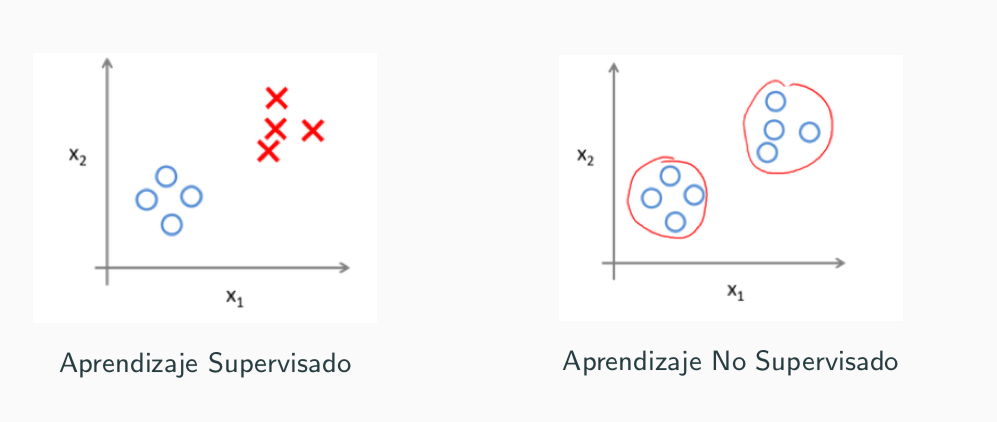
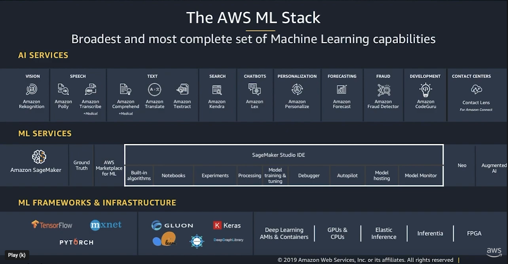
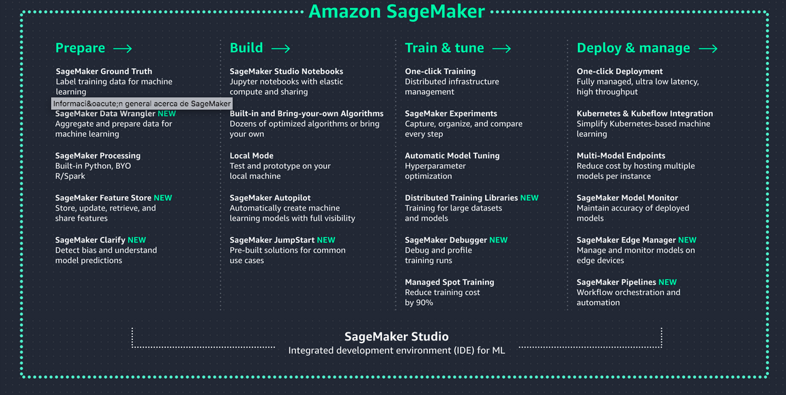
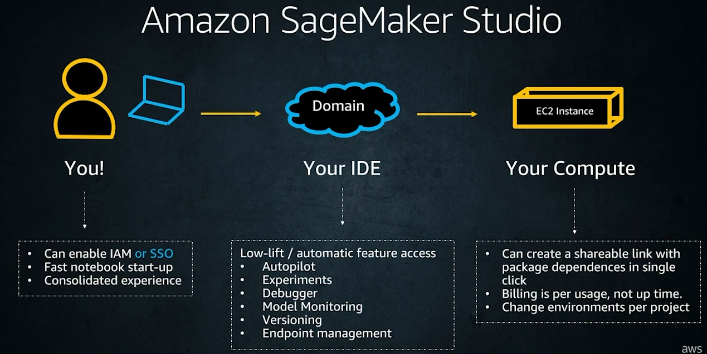
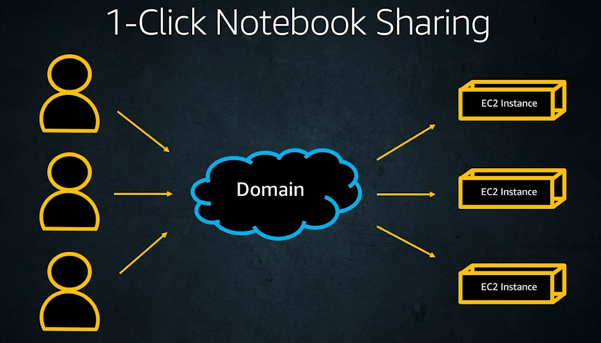
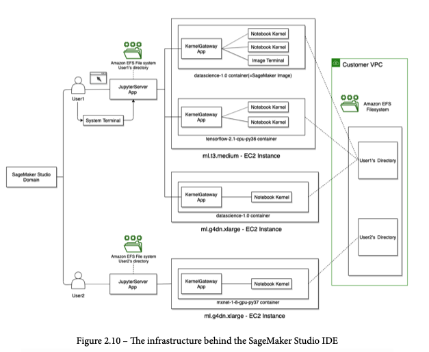
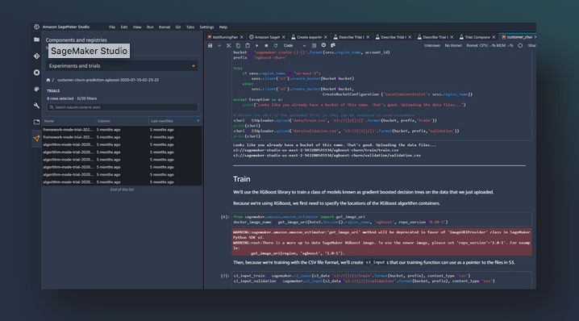

# Amazon Sagemaker

---

## Machine Learning

- Aprendizaje automático o aprendizaje automatizado o aprendizaje de máquinas 
- Del inglés, machine learning.
- En el aprendizaje de automático un software observa datos, construye un modelo basado en esos datos y utiliza ese modelo a la vez como una hipótesis acerca del mundo.
- Nos puede servir para predecir o para analizar esos datos.

---

- Aprendizaje Supervisado: Los ejemplos vienen con una variable de salida o etiqueta que queremos aprender.
- Aprendizaje No Supervisado: No existe una variable o concepto objetivo. Nos interesa descubrir patrones o relaciones que expliquen los datos.

---

- Amazon SageMaker ayuda a los científicos de datos y a los desarrolladores a preparar, crear, entrenar e implementar con rapidez modelos de aprendizaje automático de alta calidad 
- https://aws.amazon.com/es/sagemaker/

---

---

---

---

---

---

# SageMaker Studio

---

# Ejercicio

- Crea un nuevo dominio y usuario.
- Lanza Sagemaker Studio.

---

# Docs
- *Getting Started with Amazon SageMaker Studio* by Michael Hsieh.

---

- Sagemaker Developer Guide: https://docs.aws.amazon.com/sagemaker/latest/dg/whatis.html
- Amazon SageMaker Python SDK: https://sagemaker.readthedocs.io/en/stable/index.html
- Sagemaker Examples: https://sagemaker-examples.readthedocs.io/en/latest/index.html

---